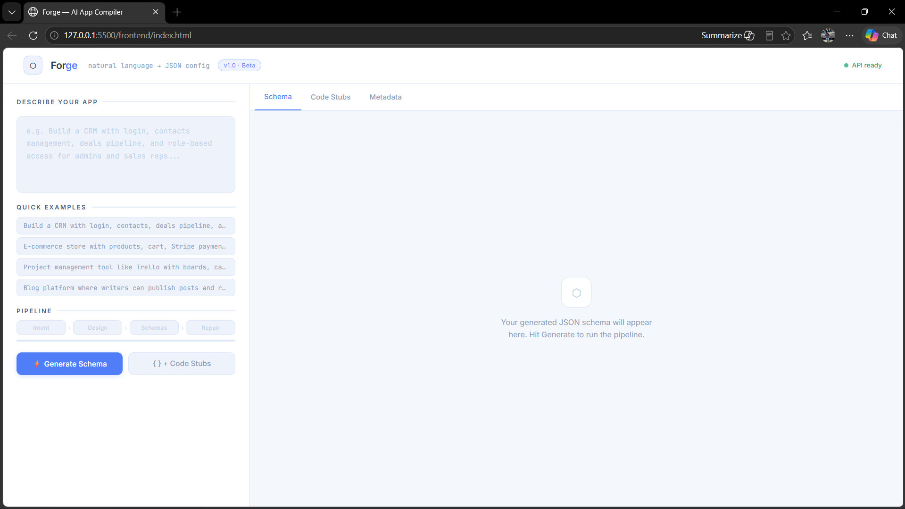

# Forge

> Natural language → validated, executable JSON config in 4 pipeline stages.

**[Live Demo](https://forge-k1tk.onrender.com)** · **[Video Walkthrough](#)**

---



---

## The Problem

LLMs are bad at producing structured output reliably. A single prompt asking for "a full app schema" will hallucinate fields, produce inconsistent JSON, and fail silently. This project treats app generation like a **compiler** — breaking the process into discrete, verifiable stages where each stage's output is validated before the next stage runs.

---

## Pipeline Architecture

```
User Prompt
    │
    ▼
┌─────────────────────────────────┐
│  Stage 1 — Intent Extraction    │  "Build a CRM with login..."
│  Parses raw prompt into         │  →  app_name, entities, roles,
│  structured intent object       │     features, assumptions
└──────────────┬──────────────────┘
               │
               ▼
┌─────────────────────────────────┐
│  Stage 2 — System Design        │  Intent
│  Converts intent into           │  →  entities + relationships,
│  concrete app architecture      │     api_structure, permission_matrix
└──────────────┬──────────────────┘
               │
               ▼
┌─────────────────────────────────┐
│  Stage 3 — Schema Generation    │  4 chained LLM calls:
│  Each call feeds into the next  │  DB → API → UI → Auth
│  to enforce cross-layer         │  (API fields pulled from DB columns,
│  consistency from the start     │   UI endpoints matched to API paths)
└──────────────┬──────────────────┘
               │
               ▼
┌─────────────────────────────────┐
│  Stage 4 — Repair Engine        │  Detects 3 error types separately:
│  Validates output, detects      │  1. Invalid / malformed JSON
│  issues, fixes only the broken  │  2. Missing Pydantic fields
│  layer (not blind full retry)   │  3. Cross-layer inconsistencies
│  Up to 3 targeted repair passes │  Fixes the specific layer, not all
└─────────────────────────────────┘
               │
               ▼
    Validated JSON Config
    + FastAPI route stubs
    + SQL CREATE TABLE statements
```

**Why multi-stage?** A single prompt producing a full app schema has no checkpoints — if the DB schema hallucinates a field name, the API and UI schemas silently inherit the error. Staging lets each layer validate before the next builds on top of it.

---

## Output Structure

Every successful run produces 4 validated layers:

```json
{
  "db_schema": {
    "tables": [{ "name": "users", "columns": [...] }]
  },
  "api_schema": {
    "endpoints": [{ "path": "/api/auth/login", "method": "POST", ... }]
  },
  "ui_schema": {
    "pages": [{ "name": "Login", "route": "/login", "components": [...] }]
  },
  "auth_schema": {
    "auth_type": "jwt",
    "roles": [{ "name": "admin", "permissions": [...] }]
  }
}
```

Cross-layer rules enforced automatically:
- API `request_body` fields must match DB column names
- UI component `api_endpoint` values must match real API paths
- Every role in `permission_matrix` must appear in `auth_schema`

---

## Repair Engine (Core Feature)

The repair engine is what separates this from a wrapper. It runs up to **3 targeted passes** after schema generation:

| Error Type | Detection | Fix Strategy |
|---|---|---|
| Invalid JSON | `json.JSONDecodeError` | LLM rewrites only the broken layer |
| Missing fields | Pydantic v2 `ValidationError` | Identifies which layer failed, repairs that layer only |
| Cross-layer mismatch | Custom consistency checker | Sends full schema + inconsistency list, LLM fixes references |

It does **not** re-run the entire pipeline on failure. If only the UI schema has a bad endpoint reference, only the UI schema gets repaired.

---

## Evaluation Results

Ran 20 prompts through the full pipeline — 10 normal product prompts and 10 edge cases (vague, conflicting, incomplete, gibberish).

| Metric | Result |
|---|---|
| Overall success rate | tracked in `evaluation_results.json` |
| Normal prompts success rate | tracked in `evaluation_results.json` |
| Edge case success rate | tracked in `evaluation_results.json` |
| Avg latency per request | tracked in `evaluation_results.json` |
| Avg repairs per request | tracked in `evaluation_results.json` |

Run the evaluation yourself:

```bash
python evaluation/run_eval.py
# outputs evaluation/evaluation_results.json
```

Edge cases tested include: single-word prompts, contradictory permissions, no-auth apps, mixed-language input, extremely large scope, and near-gibberish input.

---

## Cost vs Quality Tradeoffs

This is a system design problem, not just a prompting problem. Every decision below was a conscious tradeoff.

| Decision | Choice | Tradeoff |
|---|---|---|
| Temperature | `0.0` | Consistency over creativity — same input produces near-identical output, critical for a compiler-like system |
| Model | Llama 3.3 70B via Groq | Strong JSON instruction-following, free tier, ~2–4s per call — GPT-4o would be faster but costs ~$0.08/request |
| LLM calls per request | 6 total | Stage 1 + Stage 2 + 4× Stage 3 — more calls = more consistency but higher latency and token cost |
| Delay between Stage 3 calls | 5s sleep | Prevents Groq TPM rate limit (12k tokens/min) — costs 15s latency but avoids failed runs |
| Repair attempts | Max 3 passes | Beyond 3 = diminishing returns + significant latency added; most issues resolve in pass 1 |
| Single model vs specialist models | Single model all stages | Simpler, cheaper, easier to debug — specialist models per stage would improve quality at ~6× the cost |
| Chained context in Stage 3 | DB → API → UI → Auth | Each schema gets the previous as context — adds token cost per call but is the primary consistency mechanism |

**Token usage per request:**
- Each full pipeline run consumes ~15,000–20,000 tokens
- Groq free tier: 100,000 tokens/day → ~5–6 full runs/day
- Groq paid tier: removes daily limit, ~$0.0008/1k tokens → ~$0.02 per full run
- GPT-4o equivalent: ~$0.08–0.12 per full run, lower latency, higher quality

**Latency breakdown (approximate):**
- Stage 1: ~2–3s
- Stage 2: ~3–5s
- Stage 3: ~40–60s (4 calls × 5s delay + inference time)
- Stage 4: ~0–15s (0 if no repairs needed)
- **Total: ~50–80s per request**

The biggest latency cost is the 15s of intentional sleep in Stage 3. On a paid tier with higher TPM limits, the sleep can be reduced to 1–2s, cutting total time to ~25–35s.

---

## Project Structure

```
forge/
├── pipeline/
│   ├── stage1_intent.py      # LLM call → structured intent object
│   ├── stage2_design.py      # LLM call → architecture + permission matrix
│   ├── stage3_schemas.py     # 4 chained LLM calls → DB, API, UI, Auth
│   ├── stage4_repair.py      # validation + targeted repair engine
│   └── orchestrator.py       # connects all stages, tracks timing
├── schemas/
│   └── pydantic_models.py    # type contracts for all 4 schema layers
├── utils/
│   ├── llm_client.py         # Groq API wrapper (call_llm, call_llm_json)
│   ├── validators.py         # Pydantic + cross-layer consistency checks
│   └── code_generator.py     # FastAPI stub + SQL generator from schemas
├── evaluation/
│   ├── test_prompts.json     # 10 normal + 10 edge case prompts
│   ├── run_eval.py           # evaluation runner with metric tracking
│   └── evaluation_results.json
├── frontend/
│   └── index.html            # single-file UI, no build step
├── main.py                   # FastAPI server, serves frontend at /
├── requirements.txt
└── .env                      # GROQ_API_KEY
```

---

## Running Locally

```bash
git clone https://github.com/Sh10bh/Forge.git
cd Forge

pip install -r requirements.txt

# create .env with your key
echo "GROQ_API_KEY=your_key_here" > .env

# start the server
uvicorn main:app --reload
```

Open `http://localhost:8000` — the UI loads directly.
API docs at `http://localhost:8000/docs`.

---

## API Endpoints

**`POST /generate`**
```json
{ "prompt": "Build a task manager with login and admin dashboard" }
```
Returns: validated 4-layer JSON config + pipeline metadata (timings, repair log).

**`POST /generate-with-stubs`**

Same as above, additionally returns:
- `code_stubs.fastapi_routes` — runnable Python FastAPI file
- `code_stubs.sql_schema` — SQL `CREATE TABLE` statements

These stubs prove the output config is directly executable, not just abstract JSON.

**`GET /health`**
```json
{ "status": "ok" }
```

---

## Stack

| Layer | Choice | Reason |
|---|---|---|
| LLM | Groq (Llama 3.3 70B) | Fast inference, free tier, reliable JSON output |
| Validation | Pydantic v2 | Strict type enforcement, clear error messages for repair targeting |
| Backend | FastAPI | Async, auto-docs, easy CORS setup |
| Frontend | Vanilla HTML/CSS/JS | Zero build step, served directly from FastAPI |

---

## Deployment

Backend and frontend both served from **Render** at a single URL — `https://forge-k1tk.onrender.com`.

> Note: Free tier spins down after 15 min of inactivity. First request after sleep takes ~30s.

Auto-deploys on every push to `main` via `render.yaml`.

---

*Built by Shubh Gupta — VIT Bhopal, CS 3rd year*
